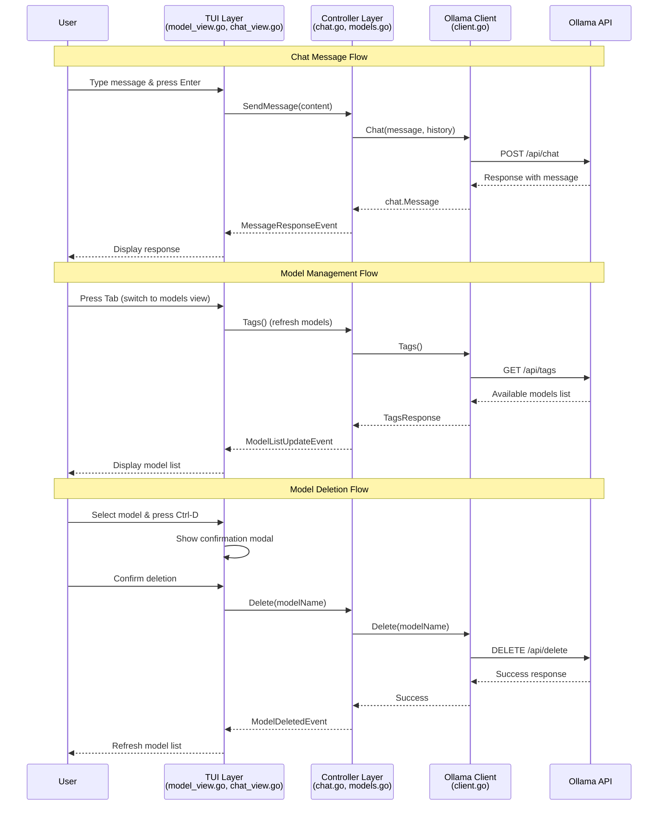

# Ryan - Core Component Interactions

## High-Level Sequence Diagram

## Key Components

| Component | Responsibility |
|-----------|---------------|
| **TUI Layer** | User interface, event handling, rendering |
| **Controller Layer** | Business logic orchestration, state management |
| **Ollama Client** | HTTP API communication, error handling |
| **Ollama API** | AI model serving, chat completion |

## Event Flow Patterns

- **Non-blocking UI**: All API calls run in goroutines with event-based updates
- **Event System**: Components communicate via tcell events (MessageResponseEvent, ModelListUpdateEvent, etc.)
- **Functional Design**: Immutable data structures, pure functions where possible